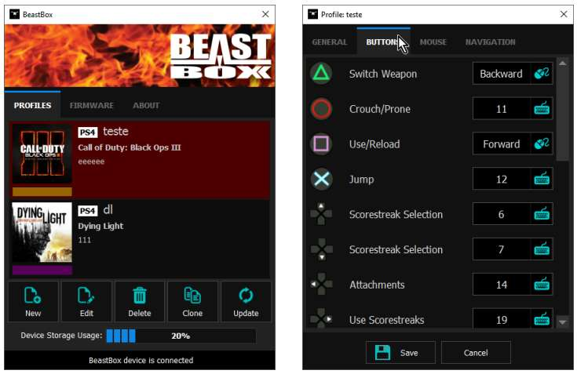

# BeastBox
Desktop Configuration Software

The BeastBox is hardware that allows you to play PLAYSTATION 3/4 using a keyboard and mouse. This project was written in c++ using QT Library.

To know more about the project, **http://softfactory.com.br**.

This program uses libusb (http://libusb.info/).

## QT dependency list to deploy the executable: ##

- icudt54.dll
- icuin54.dll
- icuuc54.dll
- libgcc_s_dw2-1.dll
- libstdc++-6.dll
- libwinpthread-1.dll
- platforms/qwindows.dll
- Qt5Core.dll
- Qt5Gui.dll
- Qt5Multimedia.dll
- Qt5MultimediaWidgets.dll
- Qt5Network.dll
- Qt5OpenGL.dll
- Qt5Positioning.dll
- Qt5PrintSupport.dll
- Qt5Qml.dll
- Qt5Quick.dll
- Qt5Sensors.dll
- Qt5Sql.dll
- Qt5WebKitWidgets.dll
- Qt5Widgets.dll

2/13/2016 2:02:32 PM 
